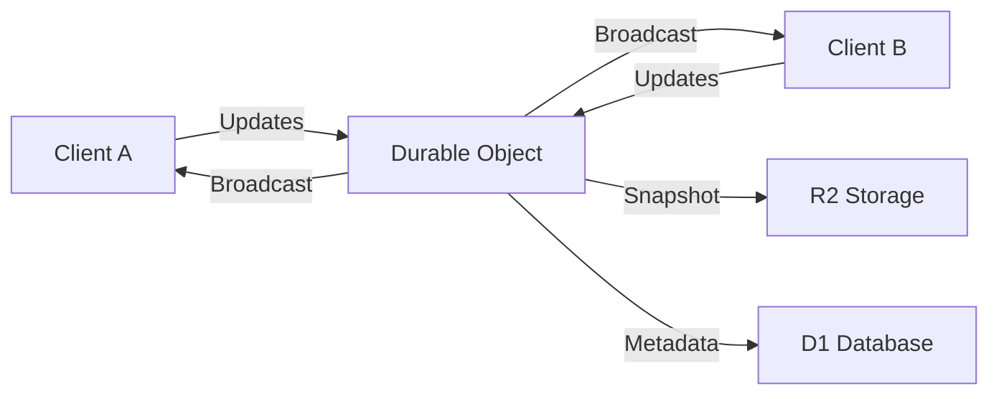

# CollabDocs

> Editor de documentos colaborativo em tempo real com sincronização CRDT


**CollabDocs** é um editor colaborativo moderno que permite edição simultânea de documentos em tempo real, com sincronização automática de conflitos usando CRDT (Conflict-free Replicated Data Types).

## ✨ Features

### MVP (Lançamento)
- 🔐 **Autenticação OAuth** - GitHub e Google
- ✏️ **Editor WYSIWYG** - Baseado em Tiptap/ProseMirror
- 🤝 **Colaboração em Tempo Real** - Sincronização CRDT com Yjs
- 👥 **Presença de Usuários** - Cursores e indicadores em tempo real
- 💬 **Comentários** - Sistema de comentários por posição
- 📚 **Gestão de Documentos** - CRUD completo com permissões
- 📖 **Histórico de Versões** - Snapshots automáticos
- 🔒 **Controle de Acesso** - Proprietário/Editor/Visualizador
- 📱 **Design Responsivo** - Interface móvel-first

### Tecnologias

**Frontend**
- Next.js 15 (App Router)
- TypeScript 5.6
- Tailwind CSS
- Yjs (CRDT)
- Tiptap (Editor)

**Backend**
- Cloudflare Workers
- Durable Objects (WebSocket)
- D1 Database (SQLite)
- R2 Storage (Snapshots)
- KV (Cache)

## 🚀 Quick Start

### Pré-requisitos

- Node.js 20+
- npm/pnpm
- Conta Cloudflare (gratuita)
- GitHub/Google OAuth Apps

### 1. Clone & Install

```bash
git clone https://github.com/seu-usuario/collab-docs.git
cd collab-docs
npm install
```

### 2. Setup Cloudflare

Execute o script de configuração automática:

```bash
./scripts/setup-cloudflare.sh
```

Este script vai:
- Criar D1 Database
- Configurar R2 Bucket
- Criar KV Namespace
- Executar migrations
- Configurar secrets OAuth

### 3. OAuth Apps

Crie OAuth Apps em:

**GitHub:**
- Settings → Developer settings → OAuth Apps
- Homepage URL: `https://seu-dominio.pages.dev`
- Callback URL: `https://seu-worker.workers.dev/auth/github/callback`

**Google:**
- Google Cloud Console → APIs → Credentials
- Authorized origins: `https://seu-worker.workers.dev`
- Redirect URIs: `https://seu-worker.workers.dev/auth/google/callback`

### 4. Development

```bash
# Inicia frontend + backend
./scripts/dev.sh

# Ou separadamente:
npm run dev              # Backend (Workers)
cd apps/web && npm run dev  # Frontend
```

Acesse:
- Frontend: http://localhost:3000
- Backend: http://localhost:8787
- WebSocket: ws://localhost:8787/ws

### 5. Deploy

```bash
# Staging
./scripts/deploy.sh staging

# Production
./scripts/deploy.sh production
```

## 📚 Arquitetura

### Fluxo CRDT



### Estrutura do Projeto

```
collab-docs/
├── apps/
│   └── web/                 # Next.js frontend
├── packages/
│   ├── shared/             # Types compartilhados
│   └── yjs-provider/       # Provider Cloudflare
├── workers/
│   ├── api/               # REST endpoints
│   ├── auth/              # OAuth handlers
│   └── durable-objects/   # DO classes
├── migrations/            # D1 SQL migrations
├── scripts/              # Deploy e setup
└── tests/               # Unit, integration, E2E
```

### Database Schema

```sql
-- Usuários OAuth
users (
  id,           -- "provider:provider_id"
  email,
  name,
  avatar_url,
  provider,     -- "github" | "google"
  provider_id,
  created_at
)

-- Documentos
documents (
  id,
  owner_id,
  title,
  visibility,   -- "private" | "public"
  created_at,
  updated_at,
  last_snapshot_r2_key
)

-- Permissões
permissions (
  document_id,
  user_id,
  role          -- "owner" | "editor" | "viewer"
)

-- Snapshots/Versionamento
snapshots (
  id,
  document_id,
  r2_key,       -- Chave do snapshot no R2
  version_number,
  author_id,
  created_at
)

-- Comentários
comments (
  id,
  document_id,
  user_id,
  parent_comment_id,
  content,
  position_json,
  created_at
)
```

## 🧪 Testes

```bash
# Unit tests
cd tests && npm test

# E2E tests
cd tests && npm run test:e2e

# Coverage
cd tests && npm run test:coverage
```

### Cobertura de Testes

- **Unit:** 90%+ funções core
- **Integration:** APIs e Workers
- **E2E:** Fluxos principais de usuário

## 📊 Performance

### Targets (conforme CLAUDE.md)

- APIs: < 100ms response
- Frontend: < 1.5s First Paint
- Bundle: < 1MB
- Tests: 90%+ coverage

### Monitoramento

```bash
# Logs em tempo real
wrangler tail

# Métricas D1
wrangler d1 execute COLLAB_DOCS_DB --command "SELECT COUNT(*) FROM documents"

# Analytics
https://dash.cloudflare.com
```

## 🔧 Scripts Disponíveis

```bash
# Development
npm run dev                    # Turbo dev (todos os packages)
./scripts/dev.sh              # Frontend + Backend
./scripts/setup-cloudflare.sh # Setup inicial

# Build & Test
npm run build      # Build all packages
npm run test       # Unit tests
npm run lint       # ESLint
npm run typecheck  # TypeScript check

# Deploy
./scripts/deploy.sh staging     # Deploy staging  
./scripts/deploy.sh production  # Deploy production

# Database
npm run db:migrate    # Aplicar migrations
npm run db:create     # Criar nova migration
```

## 🎯 Limites Gratuitos

**Cloudflare Free Tier:**
- Workers: 100k requests/dia
- D1: 5M reads, 100k writes/dia
- R2: 10GB storage, 1M writes/mês
- Pages: Ilimitado

**Estimativa:**
- ~1000 usuários ativos/dia
- ~50 documentos simultâneos
- Snapshots: ~1GB/mês

## 🔒 Segurança

- JWT assinado com HS256
- CORS configurado
- Rate limiting (Workers)
- Validação de entrada (Zod)
- OAuth only (sem passwords)

## 🤝 Contribuição

1. Fork o projeto
2. Crie branch feature (`git checkout -b feature/nova-feature`)
3. Commit mudanças (`git commit -m 'Add nova feature'`)
4. Push branch (`git push origin feature/nova-feature`)
5. Abra Pull Request

### Standards

- Commit: [Conventional Commits](https://conventionalcommits.org/)
- Code: ESLint + Prettier
- Tests: Vitest + Playwright
- Types: TypeScript strict

## 📄 Licença

MIT © [Seu Nome]

## 🙏 Agradecimentos

- [Yjs](https://github.com/yjs/yjs) - CRDT implementation
- [Tiptap](https://tiptap.dev) - Extensible editor
- [Cloudflare](https://cloudflare.com) - Edge computing platform

---

**CollabDocs** - Editor colaborativo do futuro, hoje! ✨